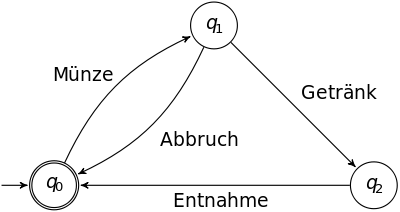
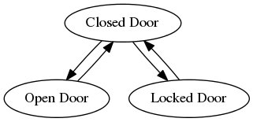

## State Pattern

State is a behavioral design pattern that lets an object alter its behavior when its internal state changes. It appears as if the object changed its class.

### Problem
- Ist eng verknüpft mit dem Konzept der deterministisch endlichen Automaten
- Bei DEAs hat man zu jedem Zeitpunkt einen möglichen Status in dem ein Programm sein kann
- Zudem verhält sich das Programm zu jedem Zeitpunkt unterschiedlich
- Das Programm kann wiederum unverzüglich von einem Status zu einem anderen wechseln (= Kein möglicher Zustand zwischen zwei Stati)
- Jedoch kann ein Programm möglicherweise nicht von einem Status zu einem anderen wechseln
- Diese Übergänge sind endlich (= also nicht unendlich) und vorbestimmt



### Beispiel


### Anwendbarkeit
- Bei Objekten die unterschiedlich agieren je nach aktuellen Status
- Es sollten schon mehr als 3 Zustände sein, damit der Aufwand gerechtfertigt ist

### Vorteile
- Alle Stati werden in eigene Klassen ausgelagert wodurch die einzelnen Zustände in der Ordner-Struktur sofort sichtbar sind (Vgl. [Screaming Architecture](https://blog.cleancoder.com/uncle-bob/2011/09/30/Screaming-Architecture.html))
- Durch die Auslagerung in Klassen ist es auch einfacher neue Stati hinzuzufügen und bestehende abzuändern wodurch die Wartungskosten reduziert werden. (Vgl. auch [Single-Responsibility-Principle](https://blog.cleancoder.com/uncle-bob/2014/05/08/SingleReponsibilityPrinciple.html) und [Open-Closed-Principle](https://blog.cleancoder.com/uncle-bob/2014/05/12/TheOpenClosedPrinciple.html))
- Die zyklomatische Komplexität wird reduziert, da große if-else bzw- switch-Blöcke entfernt werden
- Die betreffende Klasse auf der das State-Pattern angewendet wird, wird entsprechend kürzer, was ebenfalls vorteilhaft für die Wartbarkeit ist
- Code-Duplikate können dadurch zusammengefasst werden wodurch die Fehleranfälligkeit reduziert wird
- Durch abstrakte Basisklassen können zusätzlich Code-Duplikate innerhalb der Stati entfernt werden

### Nachteile
- Kann zu viel des Guten sein wenn es sich nur um wenige Stati handelt die sich nicht oft ändern

### TestDox
```
OpenedDoor
 [x] Can be closed
 [x] Cannot be opened
 [x] Cannot be locked
 [x] Cannot be unlocked

ClosedDoor
 [x] Cannot be closed
 [x] Can be opened
 [x] Can be locked
 [x] Cannot be unlocked

LockedDoor
 [x] Cannot be closed
 [x] Cannot be opened
 [x] Cannot be locked
 [x] Can be unlocked
```
